      
  
python
class KarolReges(Developer):
    """Software Engineering student @ Federal University of Goiás (UFG)."""

    lab       = "CEIA — Center of Excellence in AI"   # https://ceia.ufg.br
    research  = "Generative AI applied to Software Engineering"
    learning  = ["LLMs", "AI agents", "RAG"]          # ✏️ edit me
    ask_me    = ["AI for code", "Python", "research life"]

    def status(self) -> str:
        return "prompt → model → code → coffee → repeat ☕"
🧰  Toolbox

  
 
     

📊  Training logs

    
 
 
🥚 &nbsp;<b>Click to run <code>karol.predict()</code></b>
  
diff
+ input:  "What does Karol do on a Saturday?"
- output: "rests"                       # confidence 0.03
+ output: "fine-tunes a model for fun"  # confidence 0.97

Fun fact: ✏️ write something about you here — a hobby, a favorite paper, your go-to snack while debugging.

📬  Let's connect

    
   
 <picture> <source media="(prefers-color-scheme: dark)" srcset="https://raw.githubusercontent.com/AnaKarolinaSR94/AnaKarolinaSR94/output/snake-dark.svg"/>  </picture> 
 
